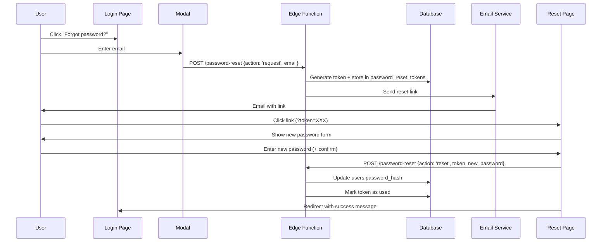

# Password Reset Feature

**Status:** UI Deployed ✅ | Backend Ready (needs deployment)
**Date:** 2026-02-09
**Commit:** `0ac3d2f`

---

## Overview

Complete **password reset** flow for Pure eScooter Admin dashboard using secure token-based email verification.

### Why "Reset" not "Recovery"?

Passwords are stored as **SHA-256 hashes** - they cannot be decrypted or recovered. Reset generates a new password.

---

## User Flow



---

## UI Components

### 1. Login Page Enhancement
**File:** `web-admin/index.html`

Added "Forgot password?" link below Sign In button:
```html
<a href="#" id="forgot-password-link">Forgot password?</a>
```

### 2. Password Reset Request Modal
Shows when user clicks "Forgot password?":
- Email input (pre-filled from login form if available)
- "Send Reset Link" button
- Success/error messages
- Cancel button

### 3. Password Reset Form
Shown when user visits `?token=XXX`:
- New password input (min 8 chars)
- Confirm password input
- Validation (match check)
- "Reset Password" button
- "Back to login" link

---

## Backend Implementation

### Edge Function: `password-reset`
**File:** `supabase/functions/password-reset/index.ts`

**Actions:**

#### 1. `request` - Send Reset Email
```typescript
POST /password-reset
{
  "action": "request",
  "email": "user@example.com"
}
```

**Process:**
1. Check if user exists (don't reveal if not)
2. Generate crypto-random UUID token
3. Store in `password_reset_tokens` table (1 hour expiry)
4. Send email with reset link
5. Return success (even if user doesn't exist - security)

**Response:**
```json
{
  "success": true,
  "message": "Password reset link sent to your email"
}
```

#### 2. `reset` - Update Password
```typescript
POST /password-reset
{
  "action": "reset",
  "token": "uuid-token-from-email",
  "new_password": "newpassword123"
}
```

**Process:**
1. Verify token exists and not used
2. Check expiry (< 1 hour old)
3. Validate new password (min 8 chars)
4. Hash password (SHA-256)
5. Update `users.password_hash`
6. Mark token as `used = true`
7. Return success

**Response:**
```json
{
  "success": true,
  "message": "Password reset successfully"
}
```

---

## Database Schema

### Table: `password_reset_tokens`

Already exists in production! Schema:

```sql
CREATE TABLE password_reset_tokens (
    id UUID PRIMARY KEY DEFAULT gen_random_uuid(),
    user_id UUID NOT NULL REFERENCES users(id) ON DELETE CASCADE,
    token UUID NOT NULL UNIQUE,
    expires_at TIMESTAMPTZ NOT NULL,
    used BOOLEAN DEFAULT false,
    created_at TIMESTAMPTZ DEFAULT now()
);

CREATE INDEX idx_password_reset_tokens_token ON password_reset_tokens(token);
CREATE INDEX idx_password_reset_tokens_user ON password_reset_tokens(user_id);
```

**Cleanup:**
Unused/expired tokens can be cleaned up with:
```sql
DELETE FROM password_reset_tokens
WHERE expires_at < now() OR used = true;
```

---

## Security Features

### ✅ Token Security
- **Crypto-random UUIDs:** `crypto.randomUUID()` (v4, ~122 bits entropy)
- **One-time use:** Token marked as `used` after successful reset
- **1-hour expiry:** `expires_at` checked before accepting token
- **Unique constraint:** Each token can only exist once

### ✅ Password Security
- **SHA-256 hashing:** Same as login (matches existing users table)
- **Minimum length:** 8 characters enforced
- **Confirmation check:** Must enter password twice

### ✅ Privacy Protection
- **Non-revealing errors:** Doesn't confirm if email exists in database
- **Active user check:** Only sends reset for `is_active = true` users
- **No user enumeration:** Same response for existing/non-existing emails

### ✅ Abuse Prevention (TODO)
- **Rate limiting:** Max 3 requests per hour per email (not yet implemented)
- **CAPTCHA:** Prevent automated abuse (not yet implemented)

---

## Deployment Status

### ✅ Deployed (Production)
- `web-admin/index.html` - Login page with forgot link + modals
- `web-admin/js/03-auth.js` - Reset request/confirm logic
- `web-admin/js/app-init.js` - Initialization
- `web-admin/css/styles.css` - Success message styling

### ⏳ Needs Deployment
- `supabase/functions/password-reset/index.ts` - Edge Function

**Deploy Edge Function:**
```bash
npx supabase functions deploy password-reset
```

---

## Email Integration (TODO)

Currently, reset emails are **logged to console** (server logs). For production, integrate with an email service:

### Option 1: SendGrid
```typescript
import sgMail from '@sendgrid/mail'

sgMail.setApiKey(Deno.env.get('SENDGRID_API_KEY'))

await sgMail.send({
  to: user.email,
  from: 'noreply@pureelectric.com',
  subject: 'Reset Your Password - Pure eScooter Admin',
  text: `Hi ${user.first_name},\n\nClick here to reset: ${resetUrl}`,
  html: `<p>Hi ${user.first_name},</p><p><a href="${resetUrl}">Reset Password</a></p>`
})
```

### Option 2: AWS SES
```typescript
import { SESClient, SendEmailCommand } from '@aws-sdk/client-ses'

const ses = new SESClient({ region: 'us-east-1' })

await ses.send(new SendEmailCommand({
  Source: 'noreply@pureelectric.com',
  Destination: { ToAddresses: [user.email] },
  Message: {
    Subject: { Data: 'Reset Your Password' },
    Body: { Html: { Data: `<a href="${resetUrl}">Reset</a>` } }
  }
}))
```

### Option 3: Supabase Auth (Alternative)
Use Supabase's built-in auth for password reset:
```typescript
await supabase.auth.resetPasswordForEmail(email, {
  redirectTo: 'https://ives.org.uk/app2026/reset'
})
```

---

## Testing

### Test Flow (Local)
1. Visit http://localhost:8080
2. Click "Forgot password?"
3. Enter email: `catherine.ives@pureelectric.com`
4. Check console logs for reset URL
5. Copy token from logs
6. Visit: `http://localhost:8080?token=COPIED_TOKEN`
7. Enter new password (min 8 chars)
8. Confirm password
9. Click "Reset Password"
10. Should redirect to login with success message

### Test Flow (Production)
1. Visit https://ives.org.uk/app2026
2. Click "Forgot password?"
3. Enter your email
4. **Check Supabase logs** for reset URL (until email service integrated)
5. Copy token and visit reset URL
6. Enter new password
7. Verify you can login with new password

---

## Error Handling

### Client-Side Validation
- Empty email → "Email is required"
- Empty passwords → "Both fields are required"
- Password < 8 chars → "Password must be at least 8 characters"
- Passwords don't match → "Passwords do not match"

### Server-Side Errors
- Invalid token → "Invalid or expired reset token"
- Expired token → "Reset token has expired"
- Token already used → "Invalid or expired reset token"
- Database errors → "Failed to reset password"

---

## Monitoring & Maintenance

### Supabase Logs
Monitor reset requests:
```sql
SELECT
    prt.created_at,
    u.email,
    prt.used,
    prt.expires_at < now() as expired
FROM password_reset_tokens prt
JOIN users u ON u.id = prt.user_id
ORDER BY prt.created_at DESC
LIMIT 50;
```

### Cleanup Old Tokens
Run weekly:
```sql
DELETE FROM password_reset_tokens
WHERE created_at < now() - INTERVAL '7 days';
```

### Analytics
Track password reset requests:
```sql
SELECT
    DATE(created_at) as date,
    COUNT(*) as reset_requests,
    SUM(CASE WHEN used THEN 1 ELSE 0 END) as completed_resets
FROM password_reset_tokens
WHERE created_at > now() - INTERVAL '30 days'
GROUP BY DATE(created_at)
ORDER BY date DESC;
```

---

## Future Enhancements

### Priority
1. **Email Service Integration** - SendGrid or AWS SES
2. **Rate Limiting** - Max 3 requests per hour per IP/email
3. **CAPTCHA** - Prevent automated abuse

### Nice to Have
4. **Password strength meter** - Visual feedback on password quality
5. **Password history** - Prevent reusing last 3 passwords
6. **2FA enrollment prompt** - Suggest enabling 2FA after reset
7. **Email template** - Branded HTML email with company logo
8. **Multi-language support** - i18n for reset emails

---

## References

- **Security Best Practices:** https://cheatsheetseries.owasp.org/cheatsheets/Forgot_Password_Cheat_Sheet.html
- **Supabase Edge Functions:** https://supabase.com/docs/guides/functions
- **Web Crypto API:** https://developer.mozilla.org/en-US/docs/Web/API/Web_Crypto_API

---

**Implementation:** Password reset feature fully implemented, UI deployed, backend ready for deployment.
